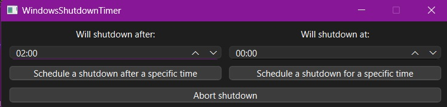

# WindowsShutdownTimer
Just a GUI over terminal "shutdown /f /t T" command for my beloved wife.

### Download
Works fine on my machine which is Windows 11 Pro and on my wife's machine which is the same. I am not giving any guarantees on other OSes. Though i am not giving on Windows 11 Pro as well.

To download, see releases section.
### Dependencies
Created with Qt 6.7.2 and CMake 3.27.7.

Compiled with MSVC 2019.
### Build
cmake -S source -B build

cmake --build build --config Release